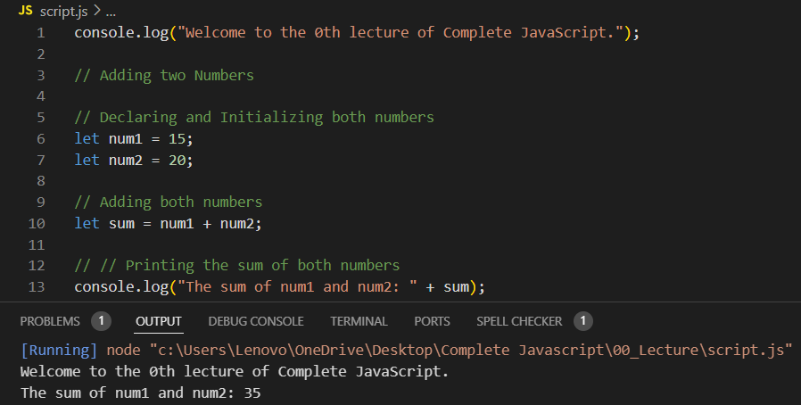
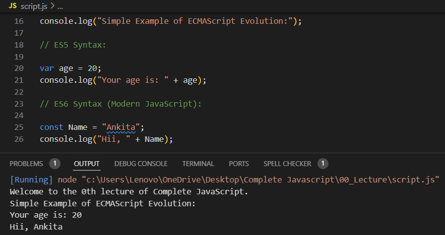

## Example of Programming:

Suppose we want your computer to add two numbers:

 

Here, the program:

- Stores two numbers.
- Add them together.
- Displays the result.

    
## Simple Example of ECMAScript Evolution:

### ES5 Syntax and ES6 Syntax (Modern JavaScript)::

The ES6 syntax is cleaner and easier to read!
