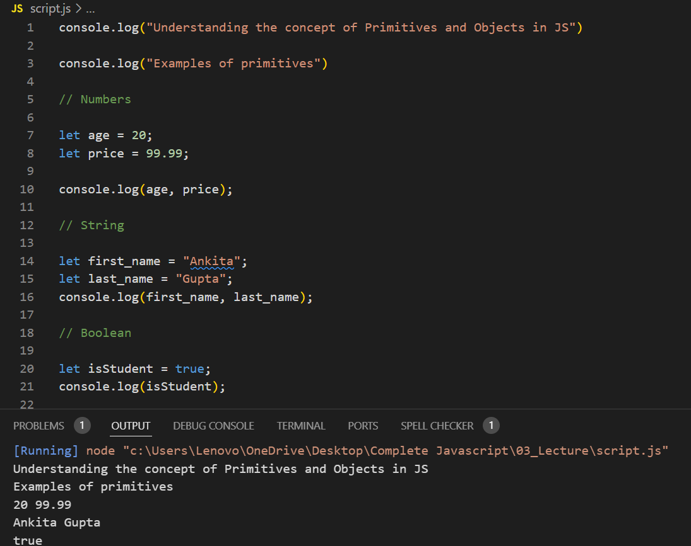
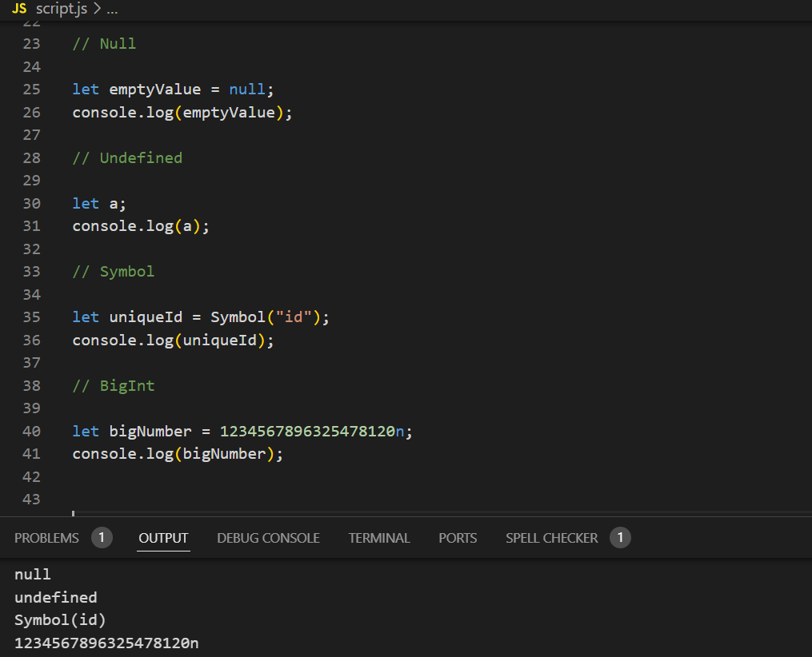
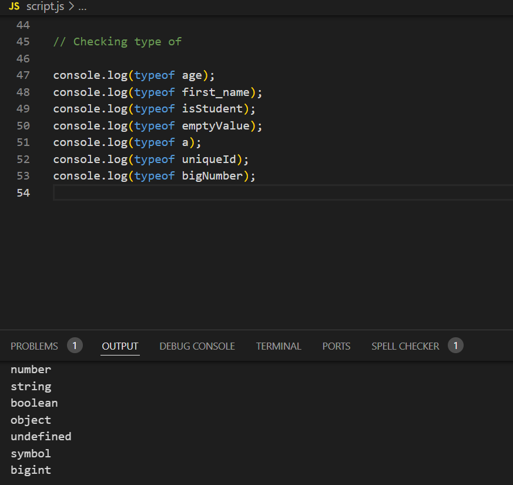
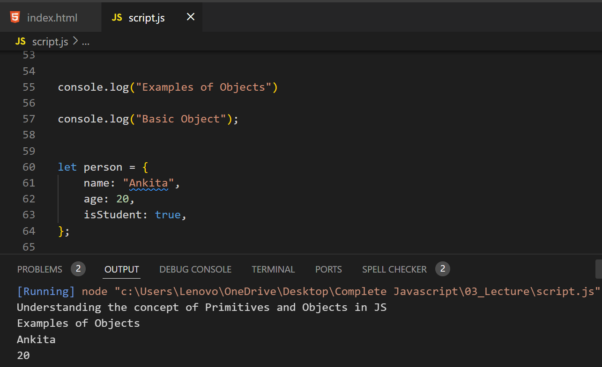
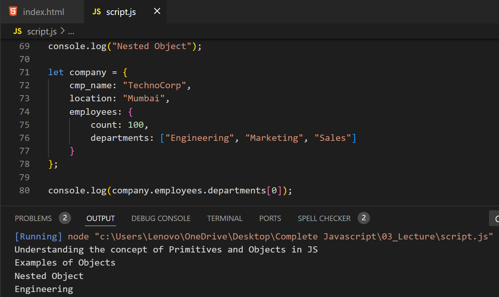
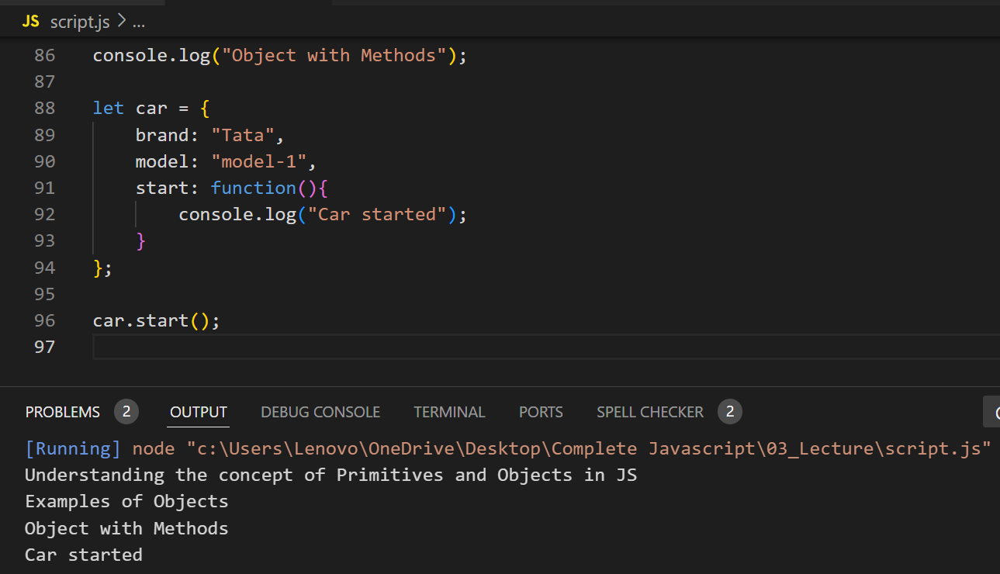
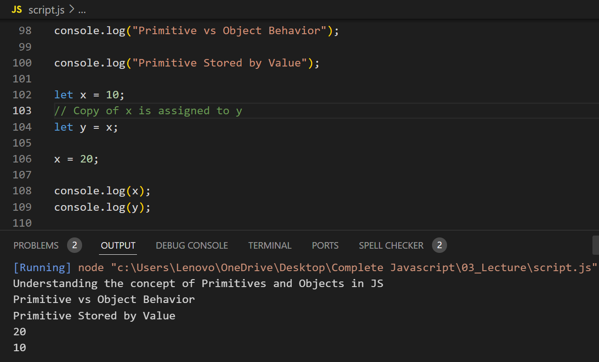
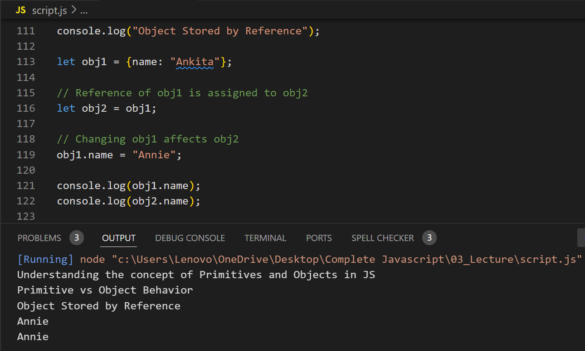

# Examples of Primitives:

# Examples of Objects:

## Basic Object:

## Nested Object:

## Object with Methods:

# Primitive vs Object Behavior

## Primitive Example (Stored by Value):

## Object Example (Stored by Reference):

