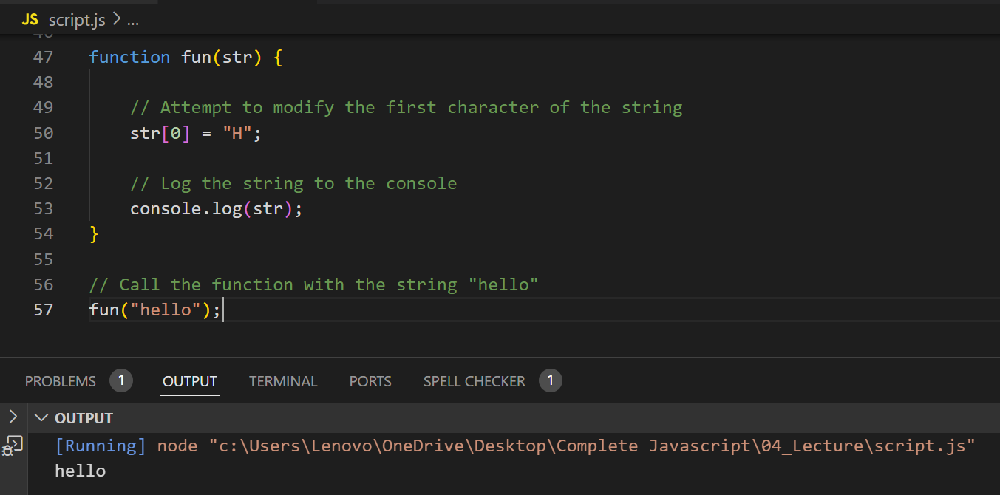

## Write a function that accepts a string and tries to change one of its characters. Log the result to show immutability.

**Note:** The code demonstrates that strings in JavaScript are immutable, meaning their individual characters cannot be changed once the string is created.

----

