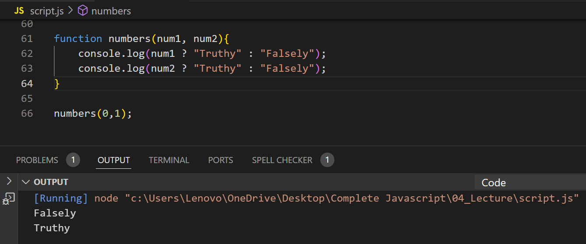

## Write a function that takes two numbers and checks if they are truthy or falsy. Log appropriate messages.

**Note:** JavaScript considers certain values as falsy, meaning they evaluate to false in a boolean context. These include:

- false
- 0
- "" (empty string)
- null
- undefined
- NaN (Not-a-Number)

Truthy Values: All other values, including non-zero numbers (5), non-empty strings ("hello"), arrays ([]), and objects ({}).
The ? : operator is a shorthand for if-else and is great for simple conditional checks.

---

