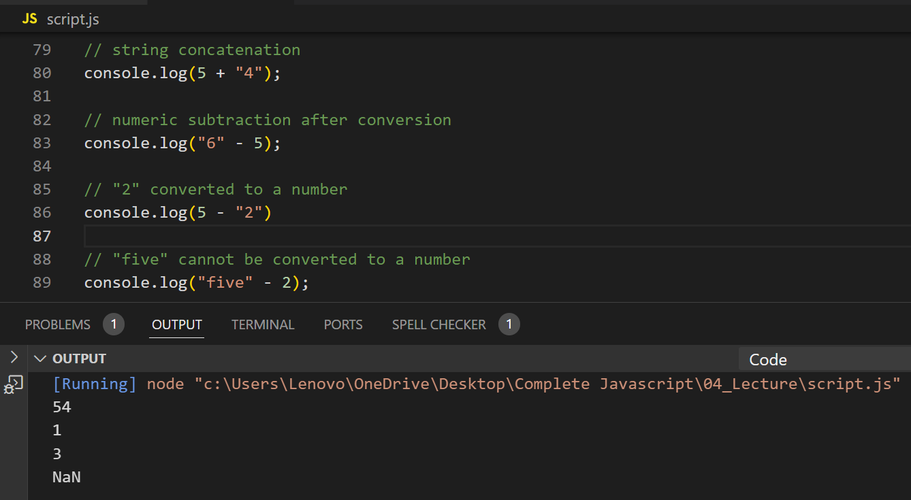

## Write a program that concatenates a number and a string, then subtracts the number from the string. Log both results.

**Note:**  

### Type Coercion in JavaScript:

When using operators like +, -, etc., JavaScript may coerce (convert) values to different types to perform the operation.

For +, if one operand is a string, it performs string concatenation.

For -, it always converts both operands to numbers and performs subtraction.

### String to Number Conversion:

Strings like "5" can be converted to numbers.

If the string cannot be converted (e.g., "five"), it results in NaN (Not-a-Number).

---

