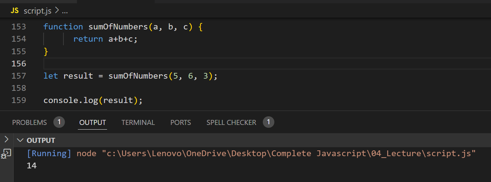

## Write a function sumOfNumbers that takes three numbers as parameters and returns their sum. Then, call the function with the values 5, 6, and 3, and log the result to the console.

## What will be the output when you run this code?

---

