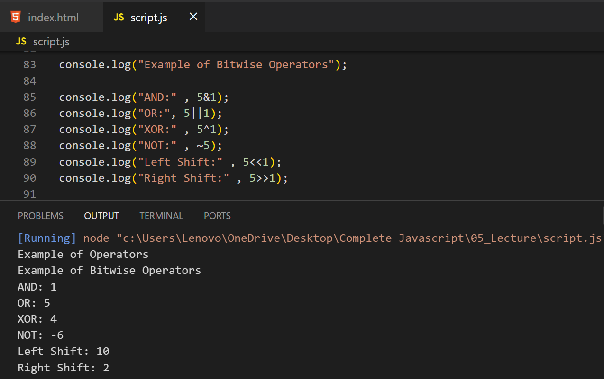
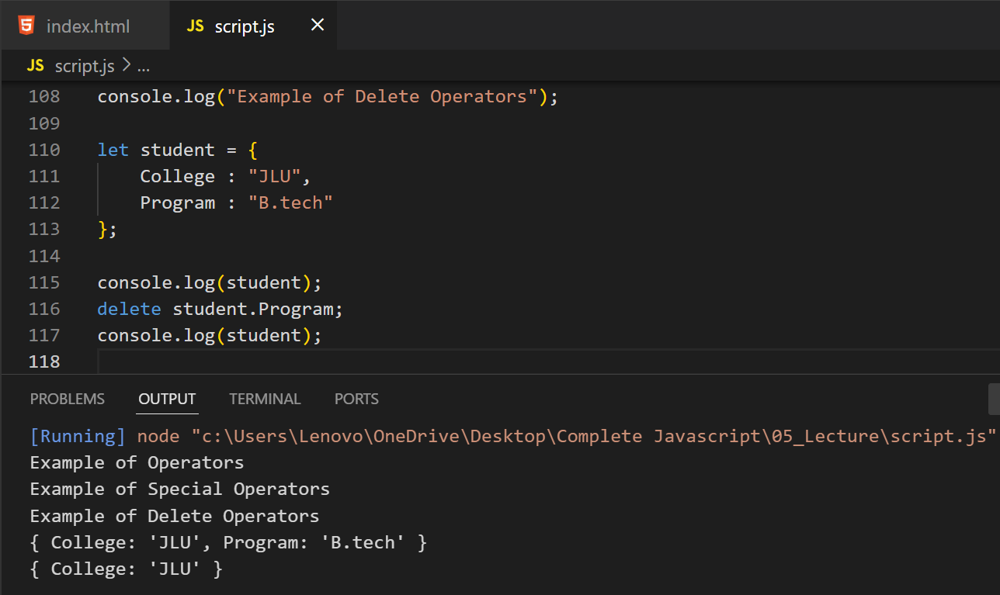

# Example Of Expressions

## Example Of Arithmetic Expressions

---

## Example Of String Expressions

---

## Example Of Logical Expressions

---

## Example Of Function Expressions

---

## Example Of Conditional Expressions

---

# Example Of Operators

## Example Of Arithmetic Operators

---

## Example Of Assignment Operators

--- 

## Example Of Comparison Operators

---

## Example Of Logical Operators

---

## Example Of Bitwise Operators

---

## Example Of Special Operators

---

### Example Of Ternary Operators

---

### Example Of Typeof Operators

---

### Example Of Delete Operators

---

### Example Of Spread Operators

---

### Example Of Rest Operators

---

# Example Of Operator Precedence 

