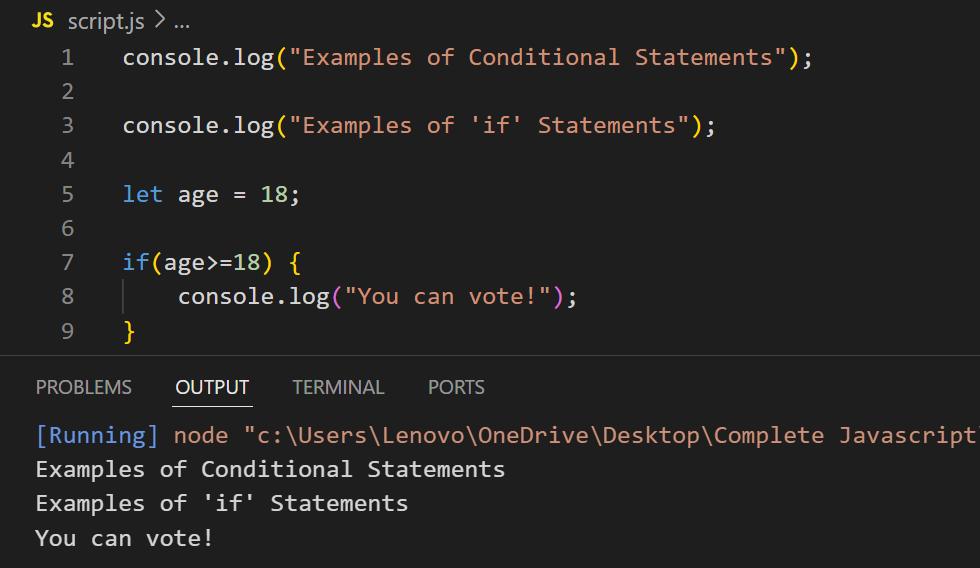
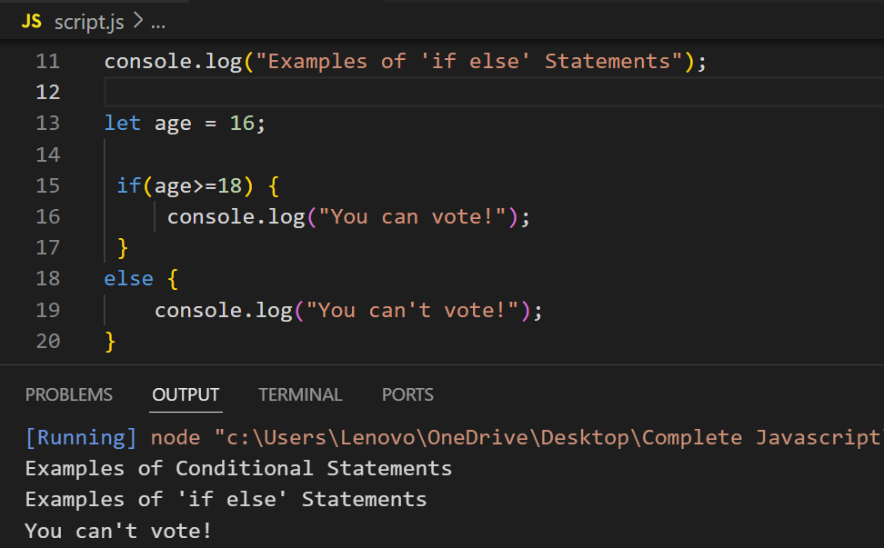
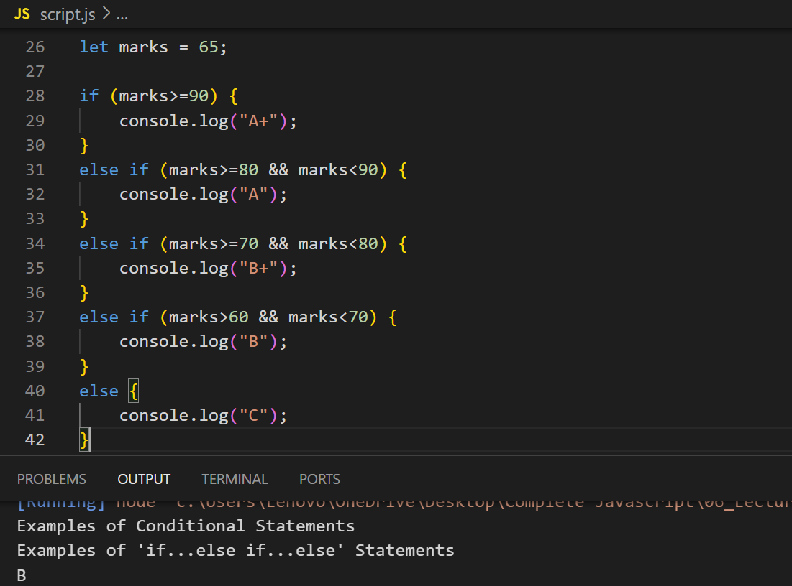
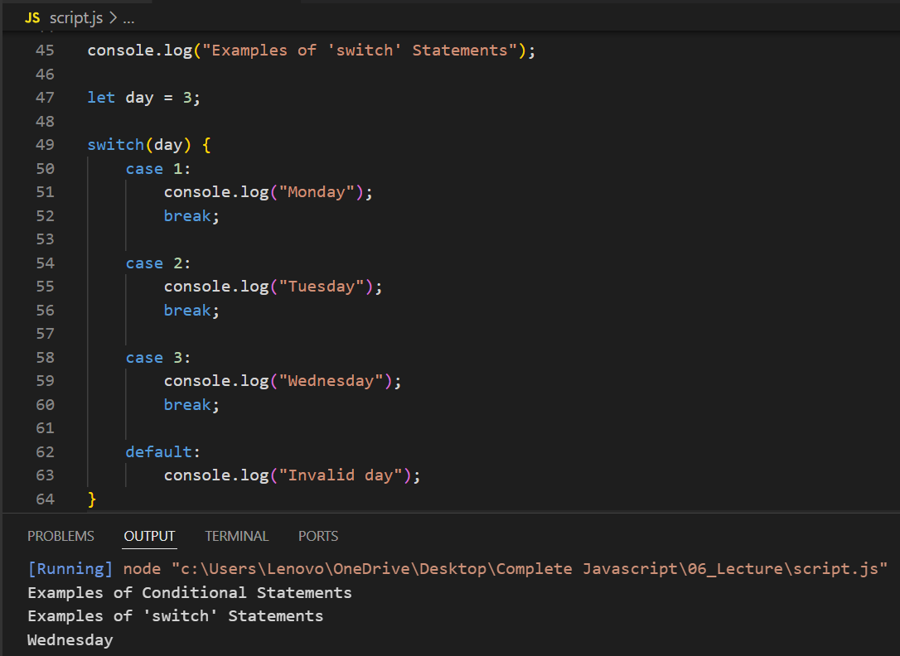
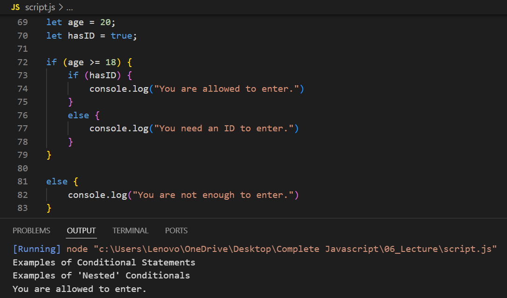
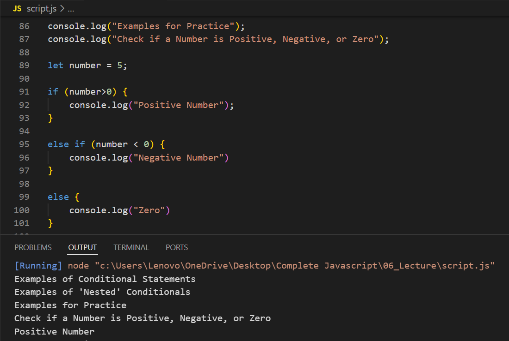

# Example of Conditional Statements in JavaScript

## a) if Statement

---

## b) if...else Statement

---

## c) if...else if...else Statement

---

## d) switch Statement

---

## e) Nested Conditionals

---

## Examples for Practice

### Check if a Number is Positive, Negative, or Zero

