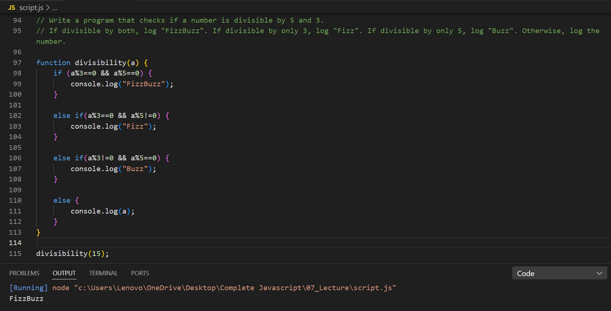

## Write a program that checks if a number is divisible by 5 and 3.
### If divisible by both, log "FizzBuzz". If divisible by only 3, log "Fizz". If divisible by only 5, log "Buzz". Otherwise, log the number.

---

