# Example of for loop

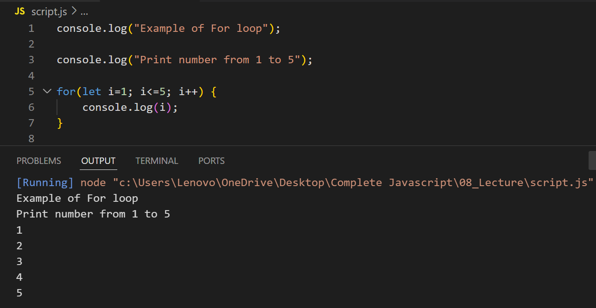

---

# Key Features of the for Loop:

## Iterate Over Numbers:

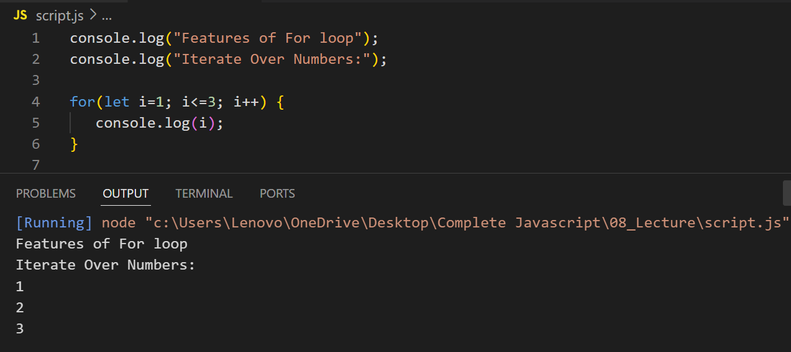

--

## Iterate Backwards:

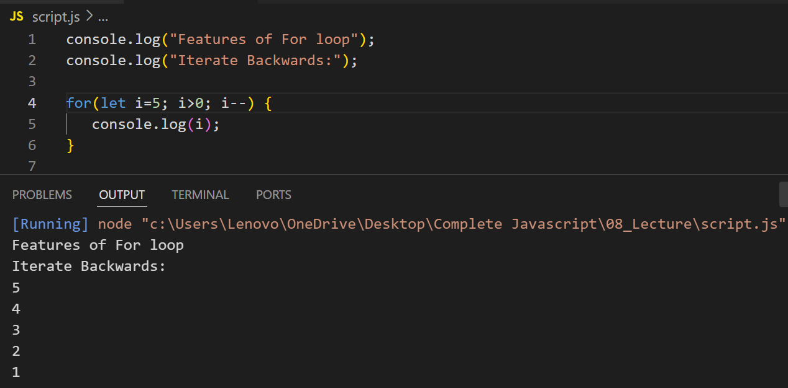

## Iterate Over Arrays:

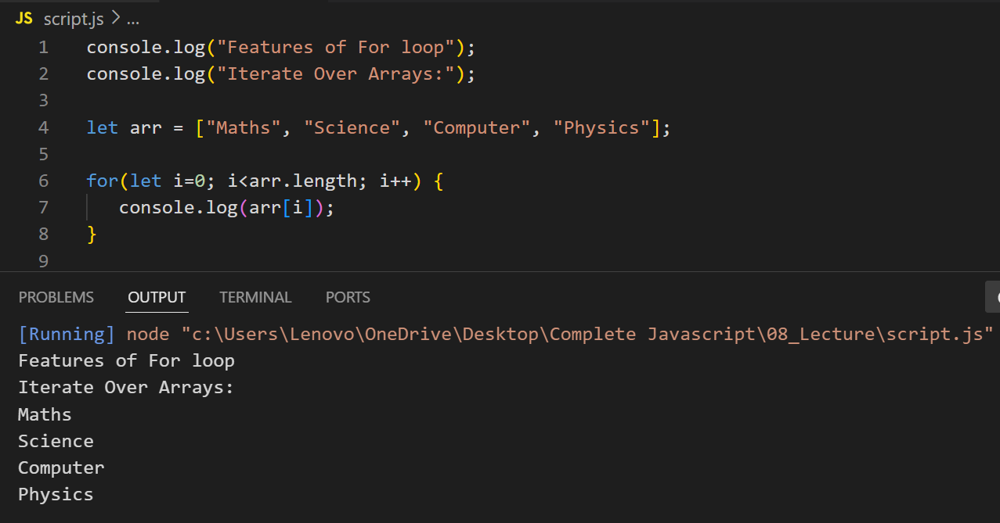

---

# Example of for...of Loop

## Iterate Over an Array:

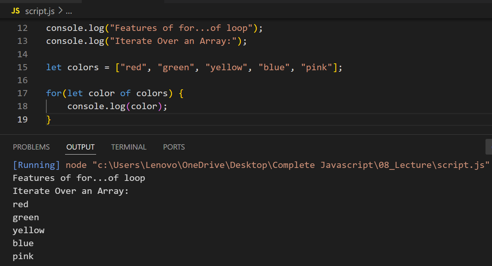

## Iterate Over a String:

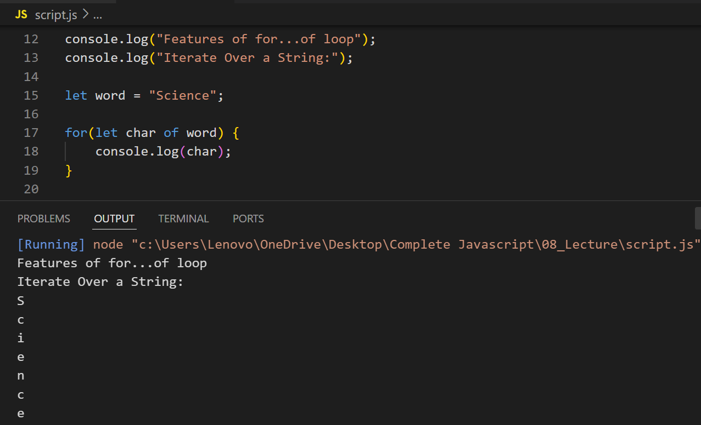

## Iterate Over a Set:

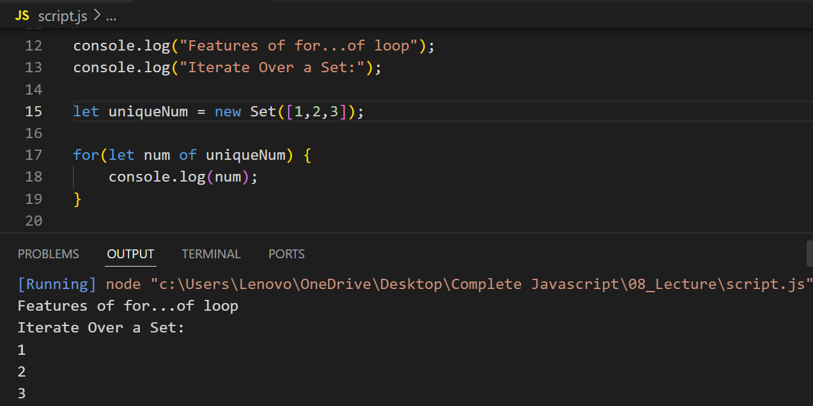

---

# Example of for...in Loop

## Iterate Over an Object:

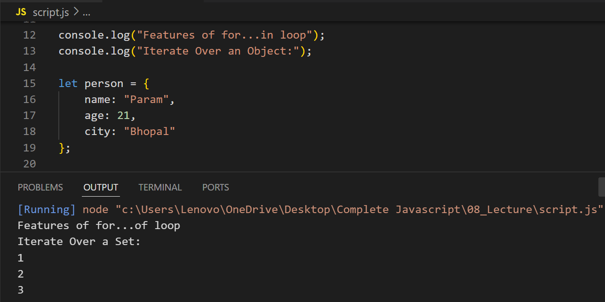

## Iterate Over Array Indexes:

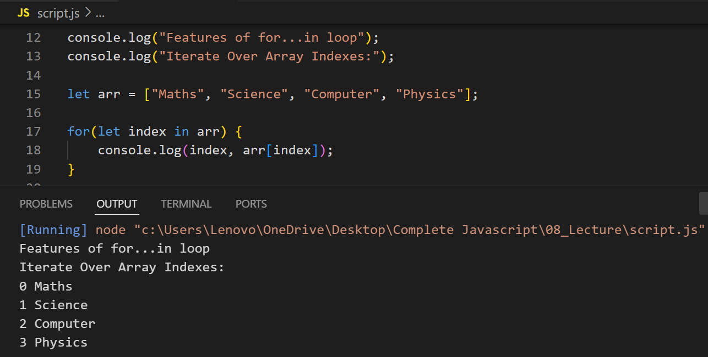

---

# Examples for Practice

## Sum All Numbers in an Array (Using for)

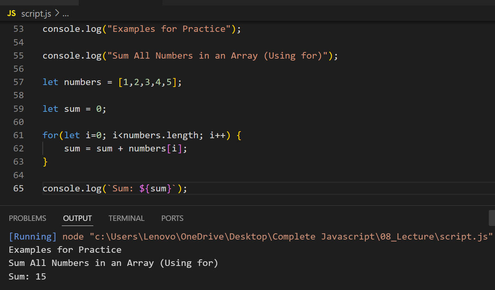

## Log Each Character in a String (Using for...of)

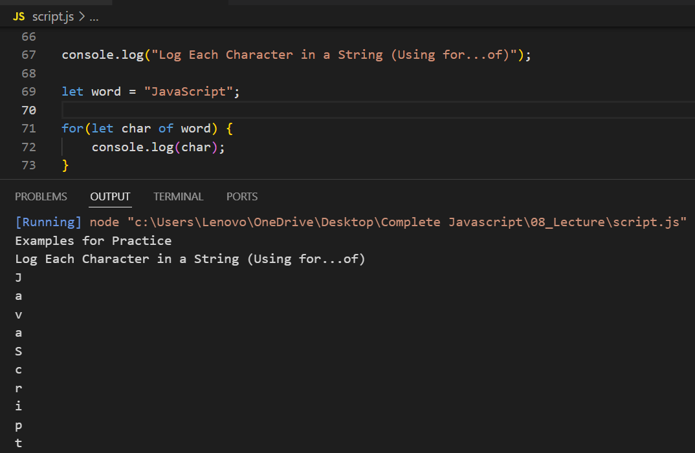

## List All Keys and Values of an Object (Using for...in)

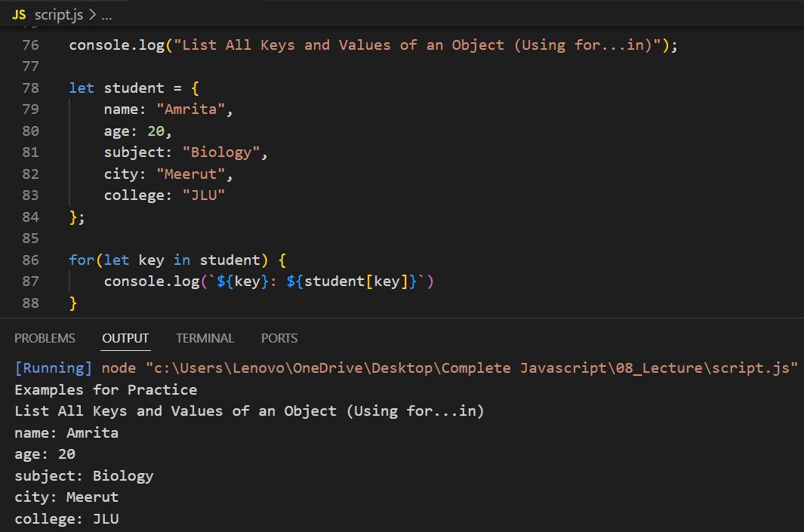

## Find Even Numbers in an Array

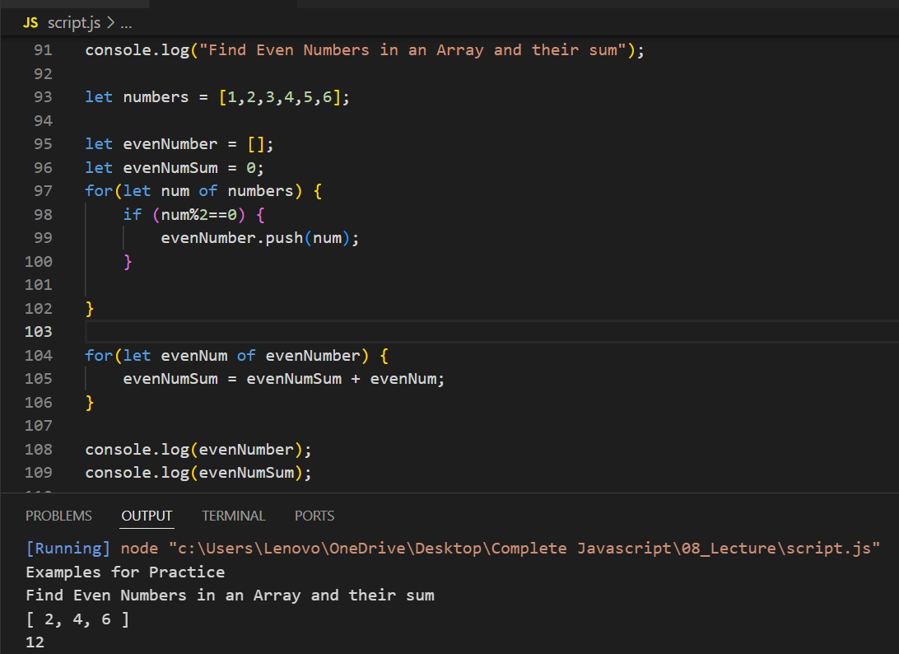
