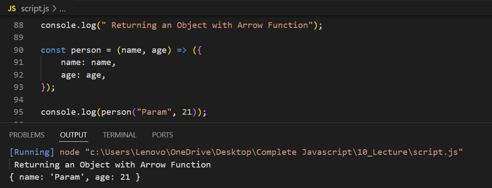

# Example of Functions Without Parameters

# Example of Functions With Parameters

# Example of Returning Values from Functions

# Example of Arrow Function Without Parameters

# Example of Arrow Function With One Parameter

# Example of Arrow Function With Multiple Parameters

# Example of Arrow Function with Implicit Return

# Examples for Practice

## Example of Calculate Square Using Functions

## Example of Using Arrow Function in Array Methods

## Example of Returning an Object with Arrow Function

