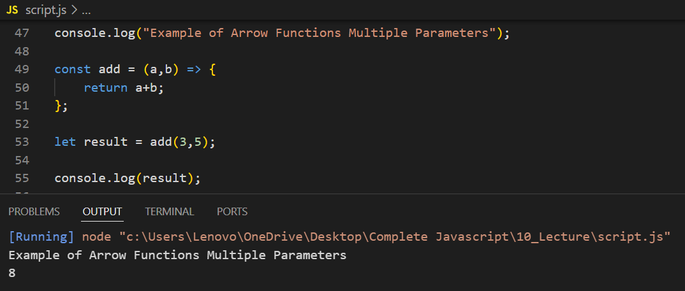
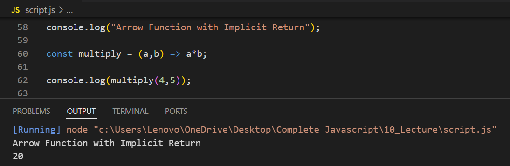
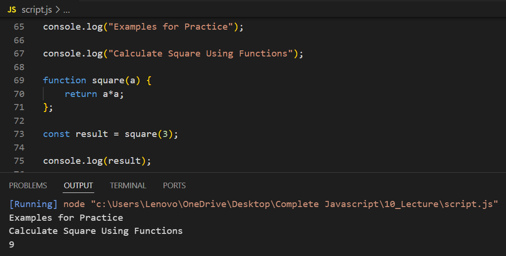
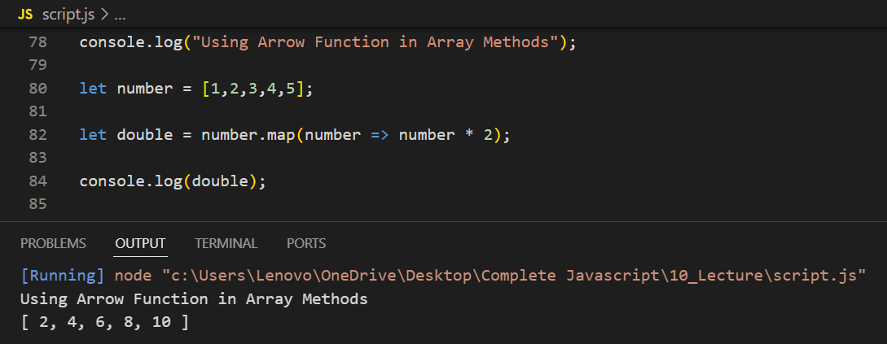

# Functions Without Parameters

# Functions With Parameters

# Returning Values from Functions

# Arrow Function Without Parameters

# Arrow Function With One Parameter

# Arrow Function With Multiple Parameters

# Arrow Function with Implicit Return

# Examples for Practice

## Calculate Square Using Functions

## Using Arrow Function in Array Methods

## Returning an Object with Arrow Function
