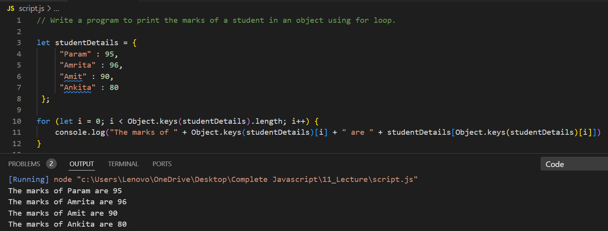
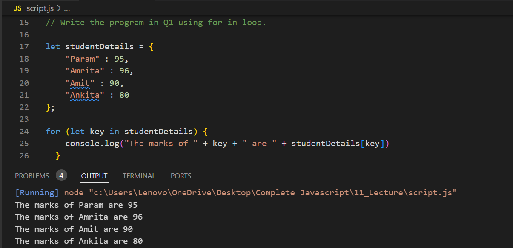
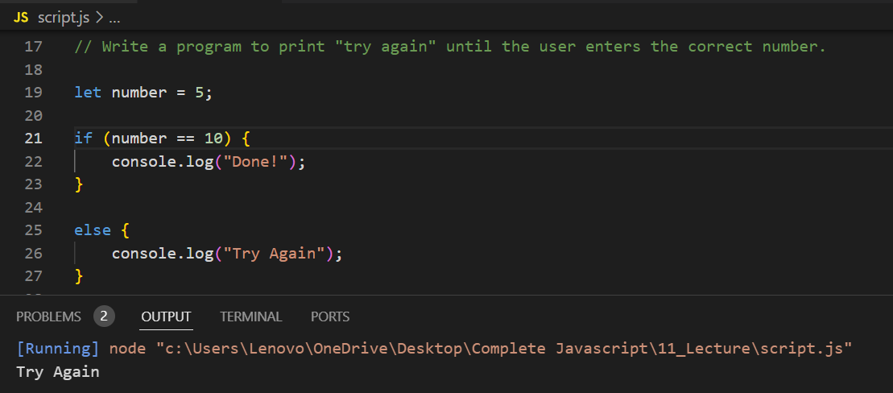
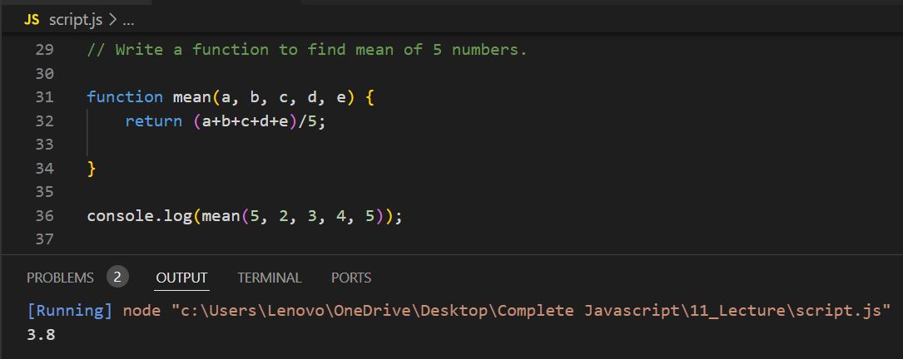

# Write a program to print the marks of a student in an object using for loop.

---

# Write the program in Q1 using for in loop.

---

# Write a program to print "try again" until the user enters the correct number.

---

