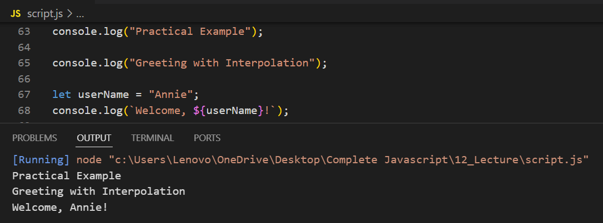

# Example of Strings in JavaScript

---

# Example of Template Literals in JavaScript

## Example of Multiline Strings in JavaScript

## Example of String Interpolation in JavaScript

---

# Example of Concatenation vs Interpolation in JavaScript

---

# Example of Escape Sequence Characters in JavaScript

---

# Practical Example

## Greeting with Interpolation

