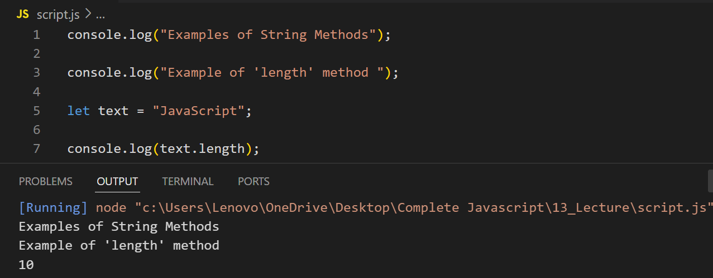
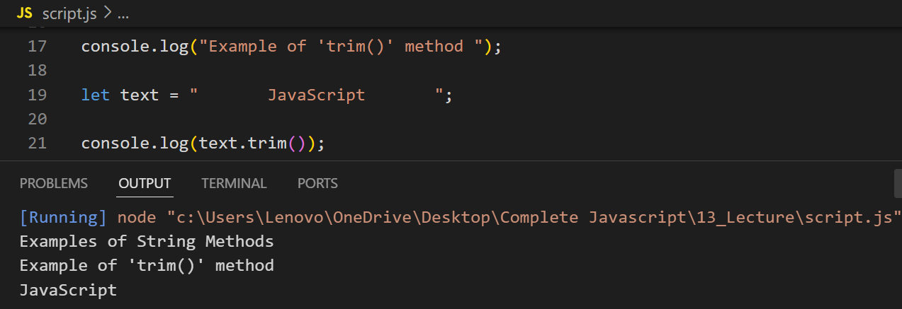
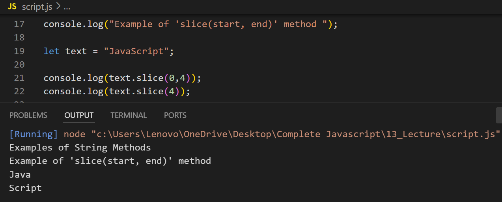
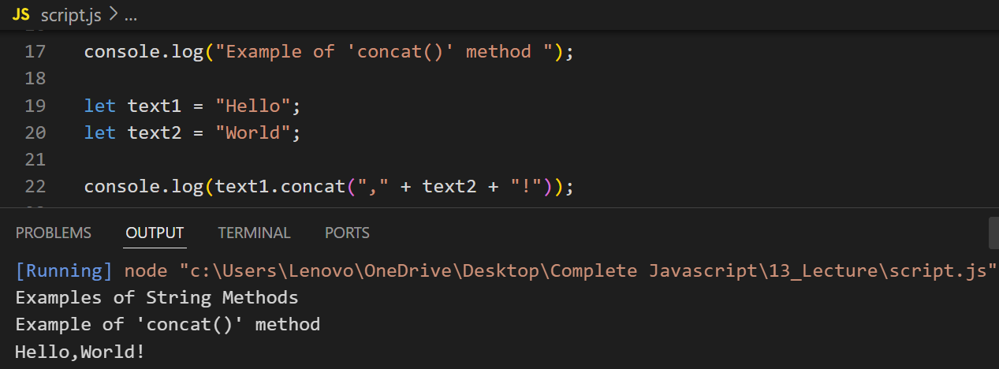
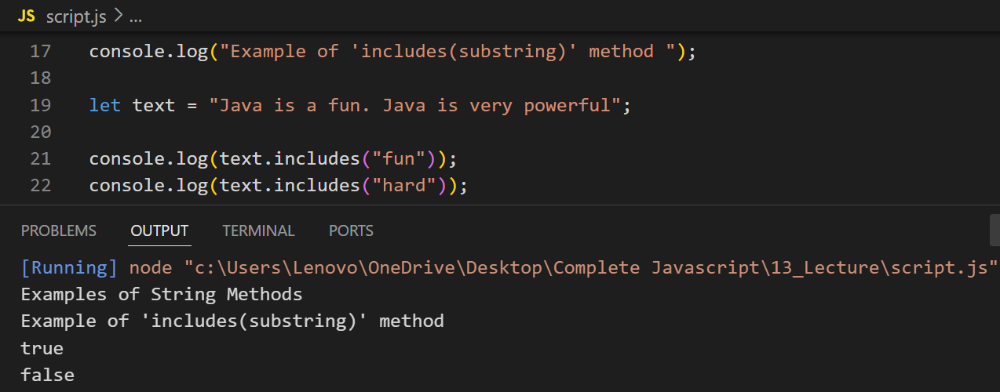
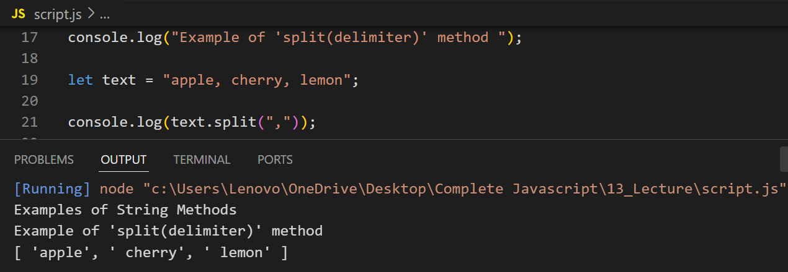
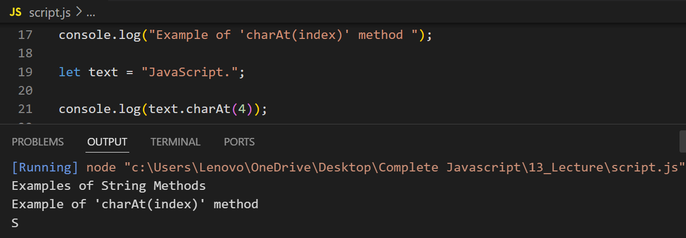
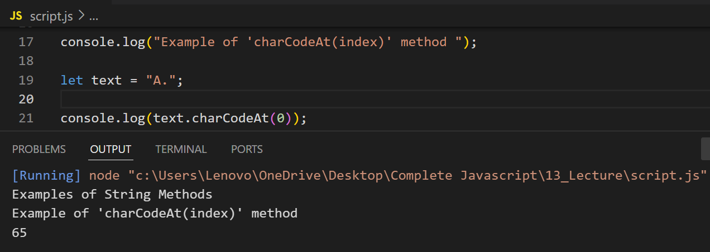
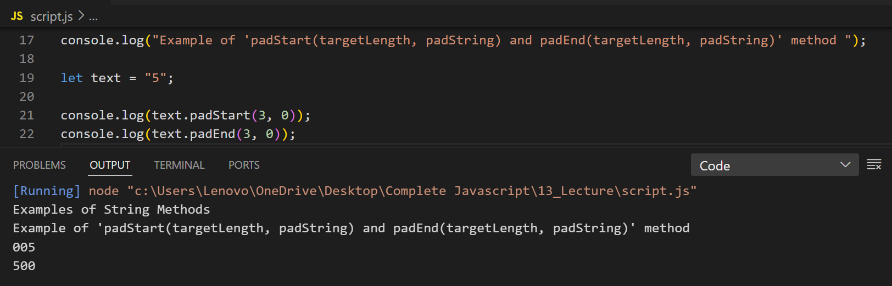

# Examples of String Methods

## Example of 'length' method

## Example of 'toUpperCase() and toLowerCase()' method

## Example of 'trim()' method

## Example of slice(start, end) method

## Example of substring(start, end) method

## Example of 'replace(searchValue, newValue)' method

## Example of 'replaceAll(searchValue, newValue)' method

## Example of 'concat()' method

## Example of 'includes(substring)' method

## Example of 'startsWith(substring) and endsWith(substring)' method

## Example of 'charAt(index)' method

## Example of 'charCodeAt(index)' method

## Example of 'repeat(count)' method

## Example of 'trim()' method

## Example of 'padStart(targetLength, padString) and padEnd(targetLength, padString)' method

## Example of 'toString()' method

## Example of 'trim()' method

